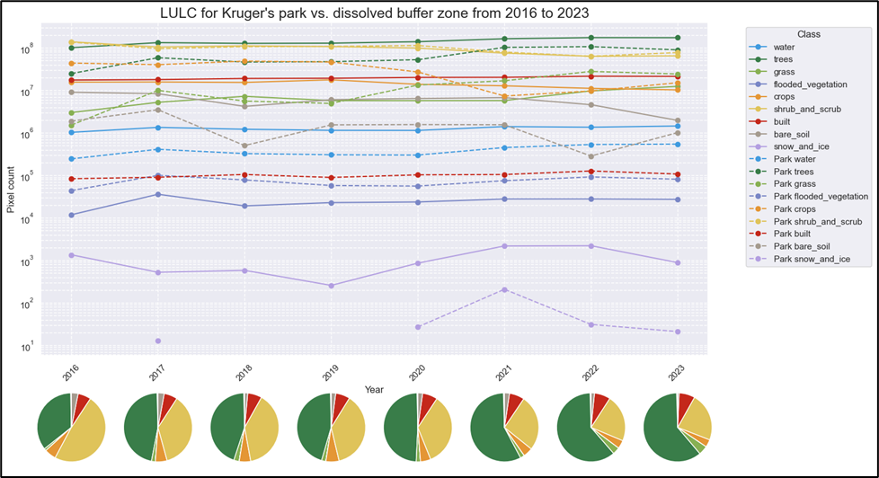
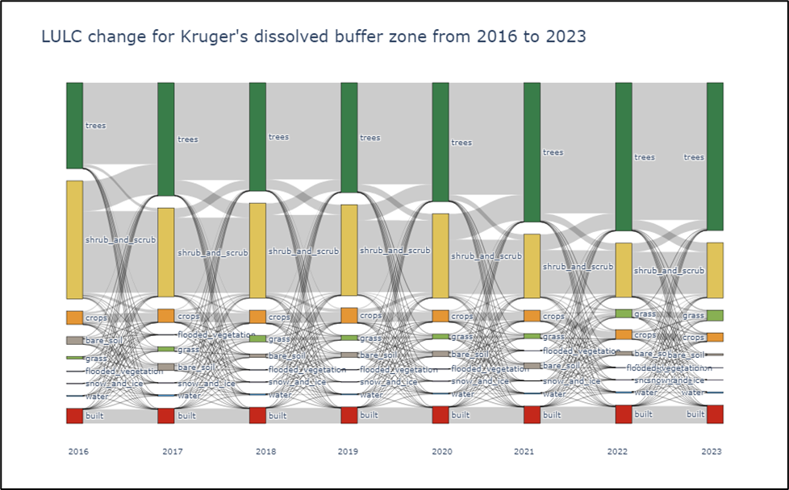
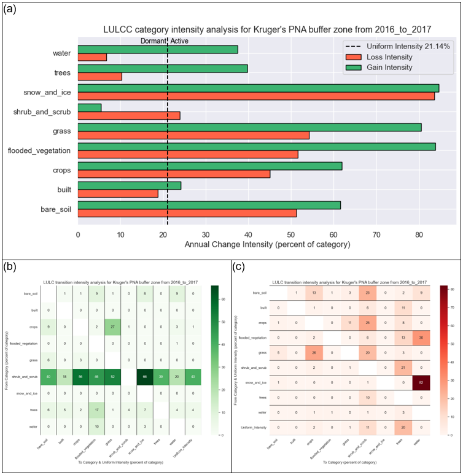
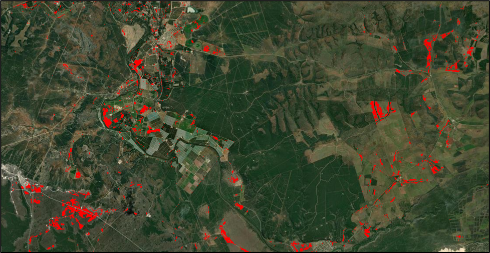

# **LULC Change Buffer Zones**  
*A Land Use and Land Cover Change (LULCC) Analysis Tool for South African National Parks' Buffer Zones*  

## 📌 **Overview**  
This repository contains the code and methodology used for analyzing **Land Use and Land Cover Change (LULCC)** in the buffer zones of **South African National Parks (SANParks)**.  

The tool is developed as part of a **Master’s thesis** and aims to **facilitate the monitoring and evaluation** of LULC- and associated environmental changes around protected areas using **Google Earth Engine (GEE) and Dynamic World LULC dataset**.  

### **Key Objectives**  
- Characterizing **primary LULC trends** in buffer zones.  
- Performing **spatio-temporal analyses** of LULC change in these zones.  
- Using **intensity analysis**, as proposed by Aldwaik and Pontius (2012), to quantify LULC changes over time.  
- Employing visual aids, such as **Sankey diagrams** and **heatmaps**, to represent these LULC transitions.  
- Encouraging adoption of this tool by **Parks and Conservation Authorities**.  

---

## 📖 **Background**  
Protected areas (PAs) in South Africa (and other parts of the world) face challenges due to **anthropogenic activities** within their buffer zones. Therefore, understanding **LULC changes** in these zones is crucial for **biodiversity conservation, land management, and policy-making**.  

This project provides a **replicable workflow** to assess LULC changes and their impact on national parks, enabling stakeholders such as:  

- 🏞 **Park Management (e.g., SANParks)**  
- 🌍 **Environmental Scientists**  
- 🏛 **Conservation Policy Makers**  
- 📡 **GIS & Remote Sensing Experts**  

---

## 📂 **Repository Structure**  
```
LULC_change_buffer_zones/  
│── assets/               # Images used in README
│── data/                 # Park and buffer zone boundaries & LULC datasets (2016-2023)  
│── notebooks/            # Jupyter Notebook(s) used for analysis  
│── scripts/              # Python scripts for modules
│── .gitignore            # Files to exclude from Git  
│── config.json           # Setting the base path and parameters  
│── LICENSE               # License information 
│── README.md             # Project documentation  
│── requirements.txt      # Dependencies  
```

---

## 🔧 **Installation & Setup**
To run the Jupyter Notebook, follow these steps:

### **1️⃣ Clone the Repository**
```
git clone https://github.com/YOUR_USERNAME/LULC_change_buffer_zones.git
cd LULC_change_buffer_zones
```
### **2️⃣ Set Up the Environment**
Install required dependencies:
```pip install -r requirements.txt```
Ensure you have:
- Python 3.8+
- Jupyter Notebook
- Google Earth Engine (GEE) API
- geemap
- pandas, numpy, matplotlib, seaborn, plotly
### **3️⃣ Run the Jupyter Notebook***
```
jupyter notebook notebooks/Dynamic_World_LULC_change.ipynb
```
### **4️⃣ Inside the Notebook**
The notebook is devided into 3 main sections:
- 0️⃣ **Setup** 🔢  
  - *This should always be executed as it sets the parameters used in the rest of the script*
- 1️⃣ **Data Collection** 📊  
  - *This is only needed if other years than 2016-2023 or other AoI than the SANParks and their buffer zones are of interest*
  - *This step has already been done and the data included in the repo for your convinience for the above stated time and place*
- 2️⃣ **Data Visualization** 🎨
  - *These are the first look at the LULC in the AoI with some nice visuaisations*
- 3️⃣ **LULC change intensity analysis** 🔍
  - *Based on the method developed by Aldwaik and Pontius (2012) the LULC change instensity is measured and visualised*
- 4️⃣ **LULC change hotspot mapping** 🗺️
  - *Visualise the change hotspots on a map based on the LULC change intensity analysis*

---

## 📊 **Features**
✔ Dynamically loads LULC datasets for selected parks  
✔ Visualizes changes through line graphs, Sankey diagrams, and heatmaps etc.  
✔ Computes intensity metrics (Time, Category, Transition Intensity)  
✔ Interactive selection widgets for filtering specific transitions  
✔ Geospatial mapping of filtered LULCC transitions  

---

## 🗺️ **Example Outputs**
1️⃣ **LULC Trends Over Time**  
*Line graph comparing changes in different land cover classes in a park’s buffer zone.*  
  
2️⃣ **Sankey Diagram for LULC Transitions**  
*Illustrates the flow of land cover transitions between years.*  
  
3️⃣ **Heatmaps of Transition Intensity**  
*Visualizes which land cover categories gained or lost area in each significant interval.*  
  
4️⃣ **Filtered Transition Maps**  
*Displays areas where specific LULC transitions occurred using Google Earth Engine.*  
  

---

## 📜 **License**
This project is licensed under the MIT License.

---

## 👨‍💻 **Contributors**
Donvan Grobler (Lead Researcher & Developer)  
Prof. D.P. Cilliers (Supervisor)  
Potential Collaborators Welcome!  

---

## 💬 **Feedback & Collaboration**
If you are interested in collaborating, improving, or applying this tool, feel free to: 📧 Email: donvangrobler@gmail.com  

---

## 📚 **Data Sources & Libraries**
This project relies on several open datasets and libraries for analysis:
- 🌍 **Dynamic World LULC Dataset (Google Earth Engine)**  
*Paper: Brown et al. (2022). Dynamic World, near real-time global 10 m land use land cover mapping*
- 🛰 **Google Earth Engine (GEE)**  
*Used for geospatial data processing & visualization.*
- 🗺 **geemap (Python Library)**  
*Python wrapper for Google Earth Engine, used for mapping & analysis.*
- 📊 **Python Libraries Used:**  
`pandas`, `numpy`, `matplotlib`, `seaborn`, `plotly` → for data analysis & visualization.  
`ipywidgets` → for interactive widgets in Jupyter Notebooks.